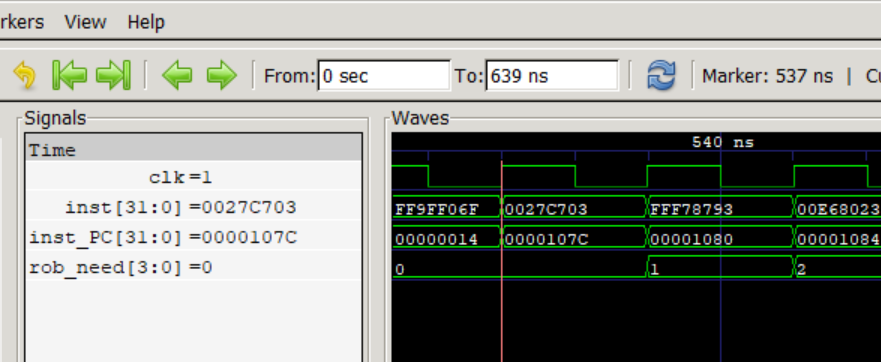
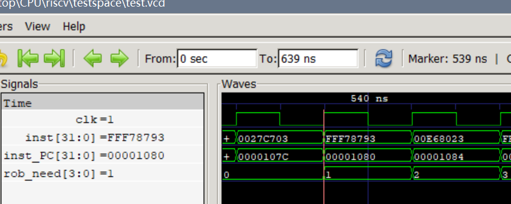
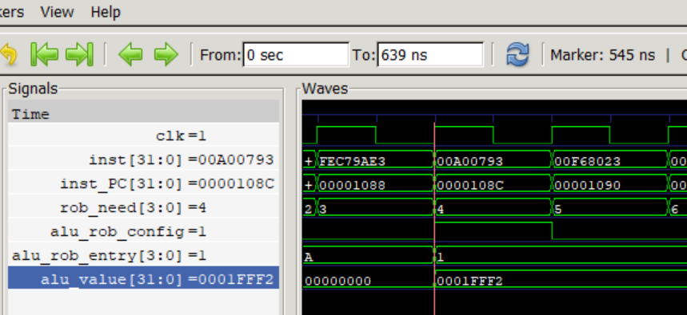
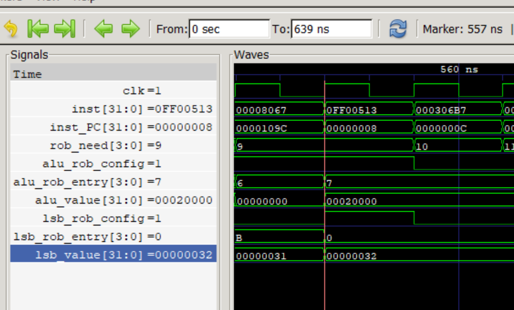

# RISCV-CPU


乱序执行的验证：

```assembly
00001058 <main>:
    1058:	000037b7          	lui	a5,0x3
    105c:	ff010113          	add	sp,sp,-16
    1060:	23078793          	add	a5,a5,560 # 3230 <__heap_start+0x1230>
    1064:	00f11223          	sh	a5,4(sp)
    1068:	03100793          	li	a5,49
    106c:	00f10323          	sb	a5,6(sp)
    1070:	00110613          	add	a2,sp,1
    1074:	00410793          	add	a5,sp,4
    1078:	000306b7          	lui	a3,0x30
    107c:	0027c703          	lbu	a4,2(a5)
    1080:	fff78793          	add	a5,a5,-1
    1084:	00e68023          	sb	a4,0(a3) # 30000 <__heap_start+0x2e000>
    1088:	fec79ae3          	bne	a5,a2,107c <main+0x24>
    108c:	00a00793          	li	a5,10
    1090:	00f68023          	sb	a5,0(a3)
    1094:	00000513          	li	a0,0
    1098:	01010113          	add	sp,sp,16
    109c:	00008067          	ret
```

在这份汇编代码中，指令`0027c703`在`fff78793`之前。

指令`0027c703`在第 537ns 时被 decoder 读取，并加入 ROB ，排在 ROB 中的第 0 个位置；



指令`fff78793`在第 539ns 时被 decoder 读取，并加入 ROB ，排在 ROB 中的第 1 个位置；



但是指令`fff78793`先执行完，在第 545ns 时被 ALU 计算完并广播。



而指令`0027c703`后执行完，在第 557ns 时被 LSB 从内存中读取并广播。



这说明了 CPU 内部是乱序执行的。